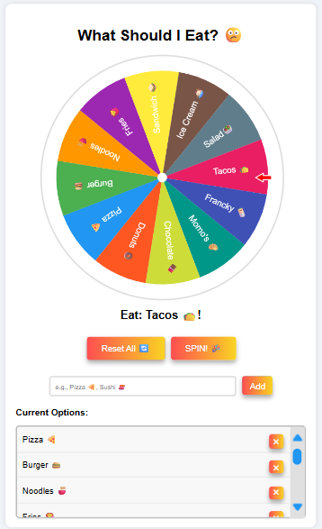
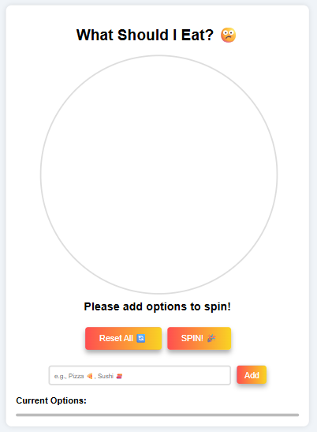

# 🎡 SpinMeNow: Customizable Spinning Wheel

 


---

## 🌟 Overview

Welcome to **SpinMeNow**, your interactive, customizable spinning wheel for making decisions fun and easy! Whether you’re picking lunch, a random winner, or just want to gamify your choices, SpinMeNow is the perfect tool.

---

## 🧑‍💻 Languages & Skills Used

-  **HTML5**
-  **CSS3** (Flexbox, Responsive Design, Custom Scrollbars)
-  **JavaScript** (DOM Manipulation, Canvas API, Local Storage)
-  **Git & GitHub**
- 🎨 **UI/UX Design**
- 📱 **Mobile Responsiveness**
- 🔊 **Audio Integration**
- 🌙 **Theme Switching**


---

## ✨ Features

- 🎯 **Customizable Options:** Add, remove, and manage your own choices.
- 🎨 **Colorful Wheel:** Each segment is beautifully colored for clarity.
- 🔊 **Sound Effects:** Fun spin sound for an engaging experience.
- 🌙 **Dark/Light Theme:** Toggle between light and dark modes.
- 📱 **Responsive Design:** Works great on desktop and mobile.
- 🗑️ **Easy Option Removal:** Remove any option with a single click.
- 🖱️ **Smooth Scrolling:** Scroll through your options list with a custom blue scrollbar.

---

## 🚀 Getting Started

1. **Clone the Repository**
    ```bash
    git clone https://github.com/Yasvi-Kachhadiya/SpinMeNow-Wheel.git
    cd SpinMeNow-Wheel
    ```

2. **Open in VS Code**
    ```bash
    code .
    ```

3. **Run Locally**
    - Open `index.html` in your browser and start spinning!

---

## 🖼️ Preview



---

## 🛠️ Project Structure

```
SpinMeNow-Wheel/
│
├── assets/
│   ├── icons/
│   └── sounds/
├── css/
│   ├── style.css
│   └── reset.css
├── js/
│   ├── wheel.js
│   ├── theme.js
│   ├── reset.js
│   └── emojimapper.js
├── index.html
└── README.md
```

---

## 📋 Usage

1. **Add your options** in the input box and click **Add**.
2. **Spin the wheel** by clicking the **SPIN! 🎉** button.
3. **See the result** where the arrow points!
4. **Remove options** anytime using the ✖ button.
5. **Reset all** with the **Reset All 🔄** button.
6. **Switch themes** using the moon/sun icon.

---

## 💡 Customization

- 🎨 **Change colors:** Edit the `colors` array in `js/wheel.js`.
- 🔊 **Change sound:** Replace the file in `assets/sounds/spin.mp3`.
- 😃 **Add emojis:** Use `emojimapper.js` for emoji suggestions.

---

## 📱 Mobile Friendly

- Touch and scroll support for the options list.
- Responsive layout for all devices.

---

## 🤝 Contributing

Pull requests are welcome! For major changes, please open an issue first to discuss what you would like to change.

---


<p align="center">
  <b>Made with <span style="color:#e25555;">❤️</span> for fun and decision-making!</b>
</p>
